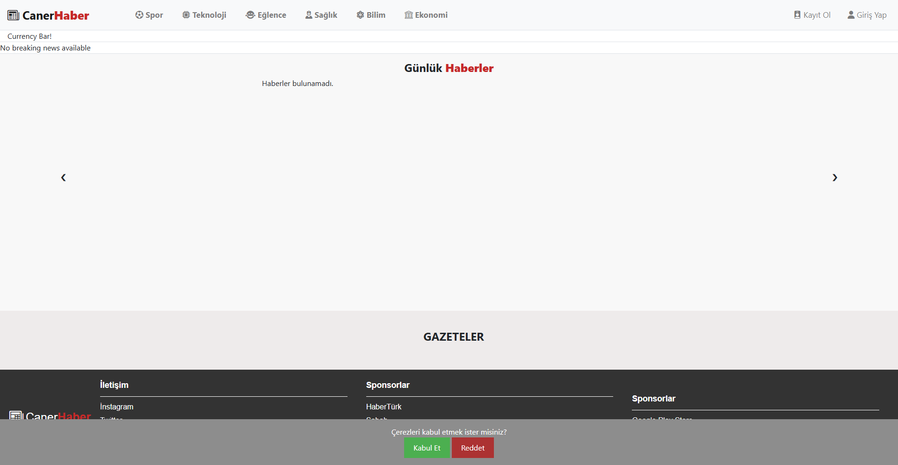
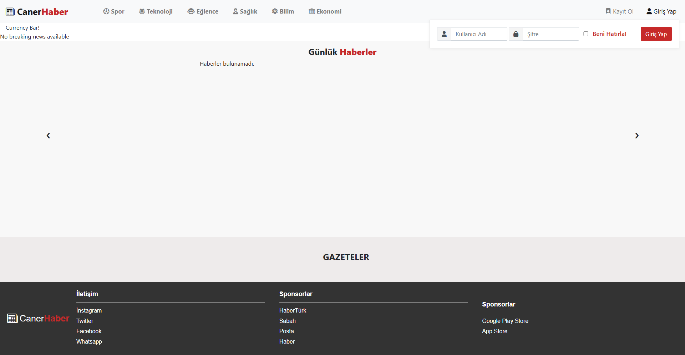
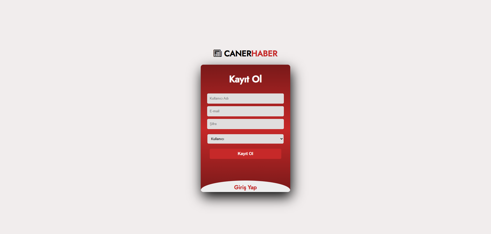

# 📰 News Website

**News Website** is a dynamic and role-based news platform that allows users to register either as a reader or as a journalist.  
Writers can publish articles while readers can explore news by category, read full articles, and follow links to newspapers.  
The application also includes live currency rates, profile management, and secure authentication using JWT.
 
---

## 🚀 Features

- 🔐 **JWT Authentication** with Role Management (User / Journalist)
- 📝 **Article Management**:
  - Journalists can add news
  - Display latest news on homepage
  - Filter by categories
  - Read full news articles
- 📰 **External Newspaper Integration** with redirection
- 📈 **Live Currency Rates** display
- 👤 **User Profile** view and update
- 🎯 Role-specific access control

---

## 🛠️ Tech Stack

| Layer         | Technologies                        |
|---------------|-------------------------------------|
| Server-side   | Node.js, Express.js                 |
| Templating    | EJS (Embedded JavaScript Templates) |
| Frontend      | HTML, CSS, JavaScript               |
| Authentication| JWT (JSON Web Token)                |
| Database      | Microsoft SQL Server (MSSQL)        |
| Tools         | Git, GitHub, Postman, VS Code       |

---

## 📷 Screenshots

### 🏠 Home Page


### 🔐 Login Page


### 📝 Register Page


---

## 📦 Getting Started

Clone the repository:

```bash
git clone https://github.com/kuyucucaner/movie-website.git
cd movie-website
npm install

---
## 🛡️ Environment Variables

PORT=5000
DB_SERVERNAME=your_db_servername
DB_NAME=your_db_name
DB_USERNAME=your_db_username
DB_PASSWORD=your_db_password
JWT_ACCESSECRETKEY:your_jwt_accessecretkey
JWT_REFRESHSECRETKEY:your_jwt_refreshsecretkey
MAIL_ID:your_mail_id
MAIL_PASSWORD:your_mail_password

---
## ▶️ Run the App
 npm start
